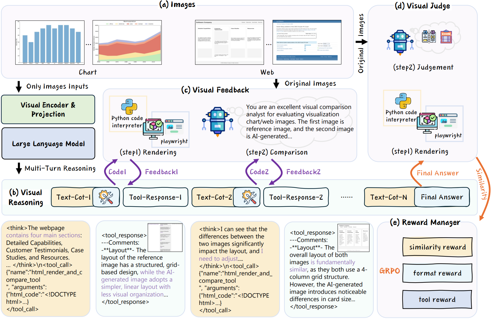

<!-- <div align="center"> -->
<!-- Place Your Project Logo Here -->
<!--  -->

# Learning Only with Images: Visual Reinforcement Learning with Reasoning, Rendering, and Visual Feedback
---
<p align="center">
       🤗 <a href="https://huggingface.co/datasets/syficy/rrvf_coldstart_chartqa">Cold-start Dataset</a> &nbsp | &nbsp
        <a href="https://arxiv.org/abs/2507.20766" target="_blank">
        📑 Paper
        </a>
       
</p>


<h1 style="font-size: 32px; color: #333; text-align: left;">
  <span style="font-size: 30px; color:rgb(180, 148, 61);">📢</span> News
</h1>
<p align="left">
🚀 <strong>2025-08-07</strong>: We open sourced the cold start data used for chart_to_code. <br>
</p>

## Table of Contents

- [Table of Contents](#table-of-contents)
- [✨ Framework Overview](#-framework-overview)
  - [Iterative Visual Reasoning](#iterative-visual-reasoning)
  - [Visual Feedback Mechanism](#visual-feedback-mechanism)
  - [Reinforcement Learning Optimization](#reinforcement-learning-optimization)
- [📊 Main Results](#-main-results)
  - [Chart-to-Code Task](#chart-to-code-task)
  - [Web-to-Code Task](#web-to-code-task)
- [📝 Citation](#-citation)
- [🙏 Acknowledgements](#-acknowledgements)

## ✨ Framework Overview

RRVF is a training framework that enhances the visual reasoning capabilities of MLLMs using **purely visual signals**. Its core is a closed-loop system comprising three key components: an iterative visual reasoner, a visual feedback mechanism, and a final visual judge.

<div align="center">

<p>Figure 2: The RRVF framework.</p>
</div>

### Iterative Visual Reasoning

The reasoning process is iterative. The model receives an image and produces a response containing internal thoughts (in `<think>` tags) and a specific action (in a `<tool_call>` tag). After the tool executes the code, the visual feedback is appended to the conversation history to inform the model's next turn, until it generates a final solution (in an `<answer>` tag).

### Visual Feedback Mechanism

This is the key to guiding the model's learning.
1.  **Rendering**: The model-generated code is executed by a domain-specific engine (e.g., Matplotlib for charts, Playwright for web pages) to render an image.
2.  **Comparison & Feedback**: A more powerful "teacher" MLLM compares the rendered image to the original, articulating the visual discrepancies (e.g., color, layout, missing elements) in natural language. This descriptive feedback provides actionable guidance for the model.

### Reinforcement Learning Optimization

The entire closed-loop process is formulated as a reinforcement learning task and optimized with the **GRPO** algorithm. We designed a hybrid reward function to guide the learning:
-   **Visual Similarity Reward (R_vision)**: Provided by the visual judge, this quantifies the fidelity between the final rendered image and the original input.
-   **Format Correctness Reward (R_format)**: Penalizes improper output formatting and non-executable code.
-   **Tool-Use Reward (R_tool)**: Encourages exploration and iterative refinement by rewarding successful tool calls.


## 📊 Main Results

### Chart-to-Code Task

#### Results on the ChartMimic test set:
| **Model** | **Exec rate** | **Text** | **Layout** | **Type** | **Color** | **GPT-4o score** | **Overall** |
| :--- | :---: | :---: | :---: | :---: | :---: | :---: | :---: |
| ***Closed-Source MLLMs*** | | | | | | | |
| (2024/02) Gemini-1.0-Pro-Vision | 68.2* | 52.6* | 64.2* | 51.3* | 47.1* | 53.3* | 53.6* |
| (2024/11) GPT-4o-2024-11-20 | 90.00 | 66.55 | 79.31 | 71.83 | 60.84 | 82.50 | 76.06 |
| (2025/04) OpenAI o3 | 90.17 | 74.17 | 80.58 | 71.37 | 63.74 | 86.45 | 79.46 |
| (2025/05) Claude-4-Sonnet | 91.83 | 68.87 | 82.43 | 67.13 | 57.59 | 85.46 | 77.23 |
| (2025/06) Gemini-2.5-Pro | 93.33 | 84.95 | 83.37 | 75.05 | 66.90 | 90.58 | 84.07 |
| ***Open-Source MLLMs*** | | | | | | | |
| (2025/02) Qwen2.5-VL-72B-Instruct| 83.83 | 34.44 | 61.71 | 45.49 | 35.12 | 50.41 | 47.30 |
| (2024/03) DeepSeek-VL-7B | 41.3* | 15.3* | 26.6* | 19.7* | 14.5* | 20.4* | 19.7* |
| (2025/02) LLaVA-OneVision-7B | 17.28 | 7.97 | 13.55 | 9.15 | 7.36 | 10.01 | 9.76 |
| (2025/02) Qwen2.5-VL-7B-Instruct | 68.83 | 30.01 | 55.79 | 36.50 | 26.91 | 39.04 | 38.17 |
| (2025/04) InternVL3-8B | <u>71.67</u>| 45.03 | 57.89 | 45.87 | 38.88 | 54.91 | 50.91 |
| --- | --- | --- | --- | --- | --- | --- | --- |
| SFT [with text labels] | 69.00 | <u>56.97</u> | <u>63.60</u> | **60.53** | **51.89** | <u>62.09</u> | <u>60.17</u> |
| Δ (vs Qwen2.5-VL-7B-Instruct) | +0.17 | +26.96 | +7.81 | +24.03 | +24.98 | +23.05 | +22.00 |
| --- | --- | --- | --- | --- | --- | --- | --- |
| RRVF (Ours) [without text labels]| **97.83**| **62.47**| **80.97**| <u>53.56</u>| <u>46.41</u>| **67.87**| **64.36**|
| Δ (vs Qwen2.5-VL-7B-Instruct) | +29.00 | +32.46 | +25.18 | +17.06 | +19.50 | +28.83 | +26.19 |


<br>
 
**note：**
Performance comparison on the ChartMimic benchmark. We report the metrics from the original ChartMimic benchmark. The best and second-best results among open-source models under 10B parameters are **bolded** and <u>underlined</u>, respectively. Results marked with * are reported by the original benchmark.
 
---

#### Results on Plot2Code (Zero-Shot):
| **Model** | **Exec Rate** | **Text** | **GPT-4o Score** | ***Text<sub>pass</sub>*** | ***GPT-4o Score<sub>pass</sub>*** |
| :--- | :---: | :---: | :---: | :---: | :---: |
| ***Closed-Source MLLMs*** | | | | | |
| (2023/09) GPT-4V | 84.1* | 48.53* | 5.45* | *57.7\** | *6.48\** |
| (2024/02) Gemini-1.0-Pro-Vision | 68.2* | 36.56* | 3.45* | *53.6\** | *5.06\** |
| (2024/06) Claude-3-Sonnet | 75.8* | 35.40* | 4.08* | *46.7\** | *5.38\** |
| (2024/11) GPT-4o-2024-11-20 | 90.15 | 48.91 | 6.09 | *54.25* | *6.76* |
| (2025/04) OpenAI o3 | 87.12 | 57.65 | 6.70 | *66.17* | *7.69* |
| (2025/05) Claude-4-Sonnet | 92.42 | 56.86 | 6.16 | *61.52* | *6.76* |
| (2025/06) Gemini-2.5-Pro | 87.88 | 71.70 | 7.65 | *81.59* | *8.71* |
| ***Open-Source MLLMs*** | | | | | |
| (2025/02) Qwen2.5-VL-72B-Instruct | 83.33 | 56.74 | 5.79 | *68.09* | *6.95* |
| (2024/03) Mini-Gemini-8x7B-HD | 73.5*| 29.91*| 2.84*| *40.7\**| *3.87\**|
| (2025/02) LLaVA-OneVision-7B | <u>84.09</u>| 26.72 | 2.75 | *31.78*| *3.27* |
| (2025/02) Qwen2.5-VL-7B-Instruct| 70.46 | <u>35.80</u>| <u>3.40</u>| *50.81*| *4.82* |
| (2025/04) InternVL3-8B | 76.52 | 30.67 | 3.25 | *40.08*| *4.25* |
| --- | --- | --- | --- | --- | --- |
| SFT [with text labels, ChartMimic trained] | 49.24 | 21.63 | 2.47 | *43.93*| *5.02* |
| Δ (vs Qwen2.5-VL-7B-Instruct) | -21.22| -14.17| -0.93 | - | - |
| --- | --- | --- | --- | --- | --- |
| RRVF (Ours) [without text labels] | **96.21**| **39.89**| **4.44**| *41.46*| *4.61* |
| Δ (vs Qwen2.5-VL-7B-Instruct) | +25.75| +4.09 | +1.04 | - | - |

<br>
 
**note:**  
Performance comparison on the Plot2Code benchmark. The best and second-best results on the primary metrics (Exec Rate, Text, GPT-4o Score) among open-source models under 10B parameters are **bolded** and <u>underlined</u>, respectively. Results marked with * are reported by the original benchmark.
 
---

### Web-to-Code Task
#### Results on the WebSight test set:
| **Model** | **CLIP Score** | **GPT Score** |
| :--- | :---: | :---: |
| ***Closed-Source MLLMs*** | | |
| GPT-4o-2024-11-20 | 88.94 | 94.55 |
| OpenAI o3 | 91.58 | 96.49 |
| Claude-4-Sonnet | 92.30 | 96.46 |
| Gemini-2.5-Pro | 77.83 | 75.88 |
| ***Open-Source MLLMs*** | | |
| LLaVA-OneVision-7B | 79.74 | 72.61 |
| Qwen2.5-VL-7B-Instruct | 83.50 | 84.17 |
| InternVL3-8B | 84.17 | 85.54 |
| --- | --- | --- |
| **RRVF (Ours)** | **88.29** | **91.50** |

<br>
 
**note:**
Performance comparison on the WebSight benchmark for web interface generation. The best results among open-source models under 10B parameters are **bolded**.
 
---


## 📝 Citation
If you use our work in your research, please cite our paper:
```bibtex
@misc{chen2025learningimagesvisualreinforcement,
      title={Learning Only with Images: Visual Reinforcement Learning with Reasoning, Rendering, and Visual Feedback}, 
      author={Yang Chen and Yufan Shen and Wenxuan Huang and Sheng Zhou and Qunshu Lin and Xinyu Cai and Zhi Yu and Jiajun Bu and Botian Shi and Yu Qiao},
      year={2025},
      eprint={2507.20766},
      archivePrefix={arXiv},
      primaryClass={cs.CV},
      url={https://arxiv.org/abs/2507.20766}, 
}
```

## 🙏 Acknowledgements
- We thank the Verl, DeepEyes framework.
- We thank the creators of the ChartMimic, Plot2Code, and WebSight datasets.
- We thank the VlmEvalkit team.